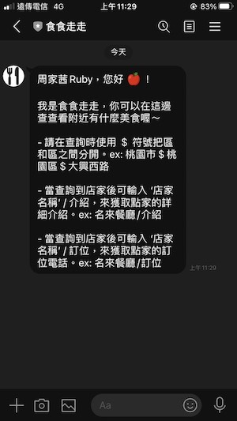
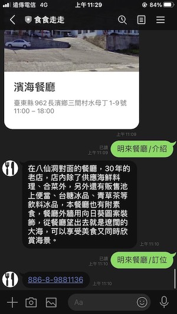

- [資料來源：政府資料開放平臺_餐飲 - 觀光資訊資料庫](https://data.gov.tw/dataset/7779)
## 食食走走linebot 介紹
- 名稱：食食走走
- 使用axios串接政府開放api，可以查詢附近美食的line機器人
- ID：@530fampr

## 使用方法
   輸入位置，區與區之間請用 ＄ 符號分隔。 ex：桃園市＄桃園區＄大興西路

- 要看更多該店家介紹，請輸入[ ‘店家名稱’/介紹 ]。ex：名來餐廳/介紹

- 輸入[ ‘店家名稱’/訂位 ]以取得訂位電話，請輸入 ‘店家名稱’/介紹。ex：名來餐廳/介紹

## 作業連結
- [儲存庫](https://github.com/22rubychou/linebot)
